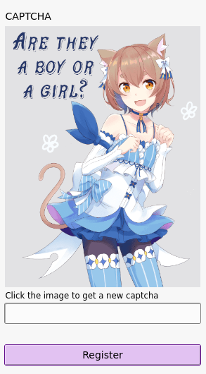

# Kaptĉapelo
Kaptĉapelo is a simple [Kocaptcha](https://github.com/koto-bank/kocaptcha)-compatible CAPTCHA server, to keep out robots and people with dubious intent. Rather than auto-generated challenges like Kocaptcha, though, Kaptĉapelo lets you create shiny, pretty, _custom_ challenges.

Since Kaptĉapelo is a kinda-sorta drop-in replacement for Kocaptcha, you can [use it as CAPTCHA](https://docs-develop.pleroma.social/backend/configuration/cheatsheet/#captcha) for your [Pleroma](https://pleroma.social) server.




## Installation
### Setup
Kaptĉapelo requires the following:

* A Common Lisp implementation. I’d recommend [Steel Bank Common Lisp](http://www.sbcl.org/), which is robust and available on many operating systems under the package-name `sbcl`.
* [Quicklisp](https://quicklisp.org/), a “package-manager” for Common Lisp libraries.

To install these, you can run the following commands (replacing `guix` with your package-manager of choice)…

```
$ guix install sbcl
$ mkdir --parents ~/.local/lib/quicklisp/
$ wget https://beta.quicklisp.org/quicklisp.lisp
$ sbcl --load quicklisp.lisp
```

And then, in SBCL, run…

```
* (quicklisp-quickstart:install :path "~/.local/lib/quicklisp/")
* (ql:add-to-init-file)
* (quit)
```

Back in the shell, we can clone Kaptĉapelo…

```
$ cd ~/.local/lib/quicklisp/local-projects/
$ git clone https://notabug.org/jadedctrl/kaptchapelo
```


### Execution
In the sources, you can find a script (`run-kaptchapelo.lisp`), which can be used like so:

```
$ # First, let’s make it executable…
$ chmod +x ~/.local/lib/quicklisp/local-projects/kaptchapelo/run-kaptchapelo.lisp
$ # … now we can run it…
$ ~/.local/lib/quicklisp/local-projects/kaptchapelo/run-kaptchapelo.lisp
```

Now, Kaptchapelo should be running and good to go; visit http://localhost:5001 and have a look!


## Configuration
### Reverse-proxy
You’ll probably be running Kaptchapelo through a reverse proxy; here’s how you can add it to an existing server definition with [nginx](https://nginx.org/):

```
server {
	[…]

	location /new {
		set $target http://localhost:5001;
		proxy_buffering off;
		proxy_pass http://localhost:5001;
	}

	location /captcha/ {
		set $target http://localhost:5001;
		proxy_buffering off;
		proxy_pass http://localhost:5001;
	}

	[…]
}
```

That is to say, you don’t need a dedicated subdomain!


### Custom captchas
Making custom captchas is easy! A challenge is simply a PNG file (question) and a TXT file (answer).
… that’s it! Literally.

Note that the PNG and TXT files should have the same name (`bird.png` and `bird.txt`, not `bird2.png` and `bird1.txt`), and that the TXT answer should consist of one line with _no_ newline.

A peek through this repository’s example captchas (in `./captcha/`) should give you the idea.


### Captcha directory
It’s likely you’ll want to provide a custom directory in which to store your captchas; no problem! Just edit the aforementioned `run-kaptchapelo.lisp` script, which contains a line…

```
:captcha-directory #p"~/.local/lib/quicklisp/local-projects/kaptchapelo/captcha/"
```

… all you have to do is replace the path there with your own.
In addition, you can also change the port and address by editing this script.


## Misc. information
Author: Jaidyn Ann `@jadedctrl@jam.xwx.moe`  
License: GNU AGPLv3
